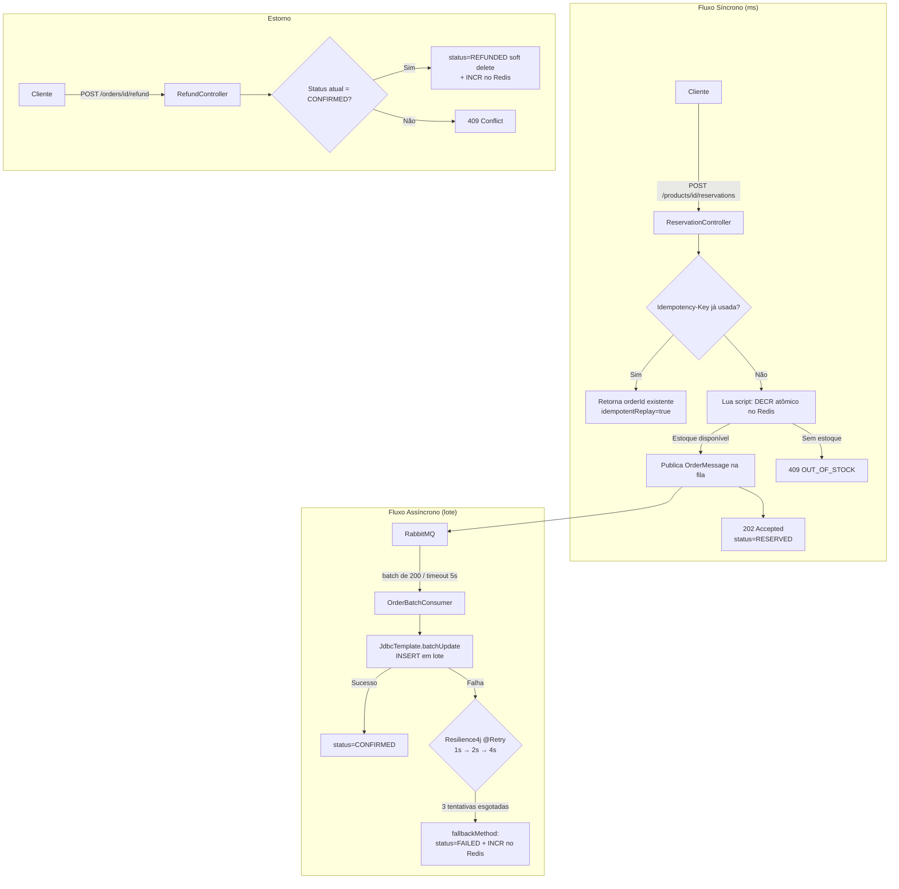

# Black Friday Sale Flow

Sistema de venda flash (Black Friday) com **Fluxo Síncrono** (reserva de estoque
em milissegundos via Redis) e **Fluxo Assíncrono** (persistência em lote no
Postgres via RabbitMQ). Arquitetura Hexagonal (Ports & Adapters).

---

<p align="center">
  
  
  
  
  
  
  
  
  
  
  
  
  
</p>

---

## 📑 Índice

- [Stacks utilizadas](#-stacks-utilizadas)
- [Pré-requisitos](#-pré-requisitos)
- [Quick Start](#-quick-start)
- [Admin — criar e repor estoque em runtime](#admin--criar-e-repor-estoque-em-runtime)
- [Fluxo síncrono — reservar estoque](#fluxo-síncrono--reservar-estoque)
- [Consultar status do pedido](#consultar-status-do-pedido)
- [Estorno](#estorno)
- [Diagrama de fluxo](#-diagrama-de-fluxo)
- [Arquitetura](#arquitetura)
- [Decisões técnicas já fechadas com o time](#decisões-técnicas-já-fechadas-com-o-time)
- [Testes](#testes)
- [Como Contribuir](#-como-contribuir)
- [Autor](#-autor)
- [Licença](#-licença)

---

## 🧱 Stacks utilizadas

| Camada             | Tecnologia                                                                 |
|---------------------|-----------------------------------------------------------------------------|
| Linguagem            | Java 25 (toolchain)                                                        |
| Framework            | Spring Boot 4.1.0 (Web MVC, Validation, JDBC, Actuator)                    |
| Cache / Reserva      | Spring Data Redis + script Lua atômico                                     |
| Mensageria           | Spring AMQP (RabbitMQ) — consumo em lote (`batchSize=200`)                 |
| Persistência         | Spring Data JPA (leitura/update) + `JdbcTemplate` (insert em lote)         |
| Migração de banco    | Flyway (`flyway-database-postgresql`)                                      |
| Banco de dados        | PostgreSQL                                                                  |
| Resiliência          | Spring AOP + Resilience4j 2.4.0 (`@Retry` declarativo com fallback)        |
| Orquestração local   | `spring-boot-docker-compose` (sobe os containers automaticamente)          |
| Testes                | JUnit 5, Mockito, MockMvc, Testcontainers 2.0.4 (Redis, RabbitMQ, Postgres)|
| Build                 | Gradle                                                                      |

---

## ✅ Pré-requisitos

- **JDK 25** instalado (ou gerenciado via toolchain do Gradle)
- **Docker** e **Docker Compose** instalados e rodando
- **Gradle Wrapper** (`./gradlew`) — já incluso no repositório, não precisa instalar o Gradle manualmente

> Não é necessário rodar `docker compose up` manualmente: a dependência
> `spring-boot-docker-compose` sobe Postgres, Redis e RabbitMQ automaticamente
> quando a aplicação inicia.

---

## 🚀 Quick Start

```bash
git clone https://github.com/erichiroshi/blackfriday-sale-flow.git
cd blackfriday-sale-flow

./gradlew bootRun             # sobe a aplicação (porta 8080) e os containers automaticamente
```

Ao rodar `./gradlew bootRun`, o `spring-boot-docker-compose` detecta o
`compose.yaml`/`docker-compose.yml` do projeto e sobe automaticamente
Postgres, Redis e RabbitMQ antes da aplicação iniciar — não é preciso
executar `docker compose up` à parte.

No startup, `StockSeedRunner` semeia o catálogo de demonstração no Redis
(configurável em `app.demo.products` no `application.yml`):

| Produto     | Estoque inicial |
|-------------|-----------------|
| `TV`        | 1200            |
| `PC`        | 1450            |
| `GELADEIRA` | 3000            |

O seed é idempotente (usa `SETNX` por baixo) — reiniciar a aplicação no meio
da promoção nunca reseta o estoque de volta ao valor inicial.

Quando terminar, é só derrubar os containers subidos pelo Docker Compose:

```bash
docker compose down
```

---

## Admin — criar e repor estoque em runtime

Além do seed automático, dá para criar novos produtos ou repor estoque de um
já existente com a aplicação rodando, sem reiniciar nada:

```bash
# Criar um novo produto (falha com 409 se já existir)
curl -i -X POST http://localhost:8080/admin/products \
  -H "Content-Type: application/json" \
  -d '{"productId": "FONE-BLUETOOTH", "initialStock": 500}'

# Repor estoque de um produto existente (soma ao contador atual, atomicamente)
curl -i -X PATCH http://localhost:8080/admin/products/TV/stock \
  -H "Content-Type: application/json" \
  -d '{"additionalUnits": 200}'
```

## Fluxo síncrono — reservar estoque

```bash
curl -i -X POST http://localhost:8080/products/TV/reservations \
  -H "Content-Type: application/json" \
  -H "Idempotency-Key: $(uuidgen)" \
  -d '{"customerId": "customer-42"}'
```

Resposta esperada (202 Accepted):

```json
{
  "orderId": "5b1f...",
  "status": "RESERVED",
  "idempotentReplay": false,
  "statusUrl": "/orders/5b1f..."
}
```

Quando o estoque acabou (409 Conflict):

```json
{
  "error": "OUT_OF_STOCK",
  "message": "Product TV is out of stock",
  "timestamp": "2026-11-27T00:00:01Z"
}
```

Reenviar a mesma requisição com o **mesmo** header `Idempotency-Key` nunca
decrementa o estoque de novo — retorna o mesmo `orderId` com
`idempotentReplay: true`.

## Consultar status do pedido

```bash
curl http://localhost:8080/orders/{orderId}
```

```json
{ "orderId": "5b1f...", "status": "CONFIRMED" }
```

`status` pode ser `RESERVED` (ainda não persistido pelo worker),
`CONFIRMED` (persistido com sucesso), `FAILED` (persistência falhou após
3 tentativas; estoque já foi devolvido ao Redis) ou `REFUNDED` (estornado).

## Estorno

Só é possível estornar um pedido `CONFIRMED` — tentar estornar um pedido em
qualquer outro estado retorna 409:

```bash
curl -i -X POST http://localhost:8080/orders/{orderId}/refund
```

Ao estornar: o pedido vira `REFUNDED` no Postgres (soft delete — nunca
removemos a linha, para manter auditoria) e 1 unidade volta para o contador
no Redis, liberada para venda novamente.

---

## 🧭 Diagrama de fluxo



---

## Arquitetura

```
domain/            <- Order, ProductId, OrderId, CustomerId, IdempotencyKey,
                       OrderStatus, StockReservationResult (Java puro, zero Spring)
application/
  port/in/         <- ReserveStockUseCase, GetOrderStatusUseCase, PersistOrderBatchUseCase,
                       ManageProductStockUseCase, RefundOrderUseCase
  port/out/        <- StockCachePort, IdempotencyPort, OrderQueuePort, OrderPersistencePort
  usecase/         <- implementações (também sem anotações Spring)
infrastructure/
  adapter/in/web/       <- ReservationController, OrderStatusController, AdminProductController,
                            RefundController, GlobalExceptionHandler
  adapter/in/event/     <- OrderBatchConsumer (RabbitListener em lote de 200, @Retry declarativo)
  adapter/out/cache/    <- RedisStockCacheAdapter (Lua atômico), RedisIdempotencyAdapter
  adapter/out/messaging/<- RabbitOrderPublisherAdapter, OrderMessage, RabbitTopology
  adapter/out/database/ <- OrderJpaEntity/Repository (leitura + update), OrderBatchInsertSetter
                            + JdbcTemplate (insert em lote), OrderPersistenceAdapter
  config/               <- RedisConfig, RabbitConfig, UseCaseConfig, StockSeedRunner,
                            DemoProductsProperties
```

---

## Decisões técnicas já fechadas com o time

1. **Reserva atômica**: script Lua faz `DECR` + `INCR` de compensação numa
   única operação atômica — nunca um `DECR` "nu", que oversell sob concorrência.
   (Avaliamos fazer isso em duas chamadas Java simples, mas decidimos manter o
   Lua para garantir que o contador nunca fique negativo nem transitoriamente.)
2. **Consumo em lote**: `SimpleRabbitListenerContainerFactory` com
   `batchSize=200` e timeout de 5s.
3. **Persistência em lote**: `JdbcTemplate.batchUpdate` + `PreparedStatement`
   fazendo `INSERT` puro (um único round-trip ao driver JDBC para o lote
   inteiro). JPA continua sendo usado para leitura (`findById`) e para o
   update de status pontual do estorno — só a escrita em massa saiu do
   Hibernate.
4. **Retry**: **Resilience4j declarativo** (`@Retry` + `fallbackMethod`) em
   `OrderBatchConsumer.consume(...)`, 3 tentativas com backoff exponencial
   1s → 2s → 4s (config em `application.yml`,
   `resilience4j.retry.instances.orderBatchPersistence`).
5. **Falha definitiva**: após esgotar as tentativas, o `fallbackMethod` marca
   o lote inteiro `FAILED` e devolve (`INCR`) o estoque no Redis.
6. **Idempotência**: chave gerada pelo cliente via header `Idempotency-Key`,
   guardada no Redis com `SETNX` + TTL de 24h.
7. **Estoque em runtime**: seed automático no startup (idempotente) **+**
   endpoint admin (`POST /admin/products`, `PATCH /admin/products/{id}/stock`)
   para criar/repor estoque com a aplicação já no ar.
8. **Estorno**: soft delete — novo status `REFUNDED`, nunca removemos a linha
   do pedido (mantém rastreabilidade/auditoria).

---

## Testes

- `OrderTest` — regras de transição de estado do agregado (incluindo refund).
- `ReserveStockUseCaseImplTest`, `PersistOrderBatchUseCaseImplTest`,
  `GetOrderStatusUseCaseImplTest`, `RefundOrderUseCaseImplTest`,
  `ManageProductStockUseCaseImplTest` — Mockito, cobrindo caminho feliz e bordas.
- `RedisStockCacheAdapterIT` — **Testcontainers**: dispara 500 requisições
  concorrentes contra 100 unidades e prova que exatamente 100 sucedem e o
  contador nunca fica negativo; também cobre `initialize`/`replenish`.
- `ReservationControllerTest`, `AdminProductControllerTest`, `RefundControllerTest`
  — MockMvc, cobrindo os principais códigos de status por endpoint.
- `OrderBatchConsumerTest` — lógica pura do consumer (delegação e fallback),
  isolada da mecânica de retry em si.
- `OrderBatchConsumerRetryIT` — sobe um contexto Spring real (AOP +
  autoconfiguração do Resilience4j) e prova que a anotação `@Retry` realmente
  dispara 3 tentativas antes de cair no fallback.

```bash
./gradlew test
```

---

## 🤝 Como Contribuir

Contribuições são muito bem-vindas!

### Processo de Contribuição

1. Fork o repositório

```bash
git clone https://github.com/SEU-USER/blackfriday-sale-flow.git
```

2. Crie uma branch de feature

```bash
git checkout -b feature/nova-funcionalidade
```

3. Faça suas mudanças
4. Adicione testes (cobertura mínima 80%)
5. Rode `./gradlew test`
6. Commit seguindo [Conventional Commits](https://www.conventionalcommits.org/)

```bash
git commit -m "feat: adiciona endpoint de busca avançada"
```

7. Push e abra um Pull Request

```bash
git push origin feature/nova-funcionalidade
```

PRs são revisados em até 48h com feedback construtivo garantido.

---

## 👤 Autor

**Eric Hiroshi**
Backend Engineer — Java / Spring Boot

- 💼 LinkedIn: [Eric Hiroshi](https://www.linkedin.com/in/eric-hiroshi/)
- 📧 Email: [erichiroshi@hotmail.com](mailto:erichiroshi@hotmail.com)
- 🔗 GitHub: [@erichiroshi](https://github.com/erichiroshi)

---

## 📄 Licença

Este projeto está sob a licença [MIT](LICENSE).

---

<p align="center">
  <em>"Código limpo é aquele que expressa a intenção com simplicidade e precisão."</em>
</p>

<p align="center">
  <strong>Desenvolvido com ☕ e 💻</strong>
</p>

---

### 🌟 Star o Projeto

Se este projeto te ajudou de alguma forma, considere dar uma ⭐ no repositório!

Dúvidas? Abra uma [issue](https://github.com/erichiroshi/blackfriday-sale-flow/issues/new) ou me chame no [LinkedIn](https://www.linkedin.com/in/eric-hiroshi/)!
